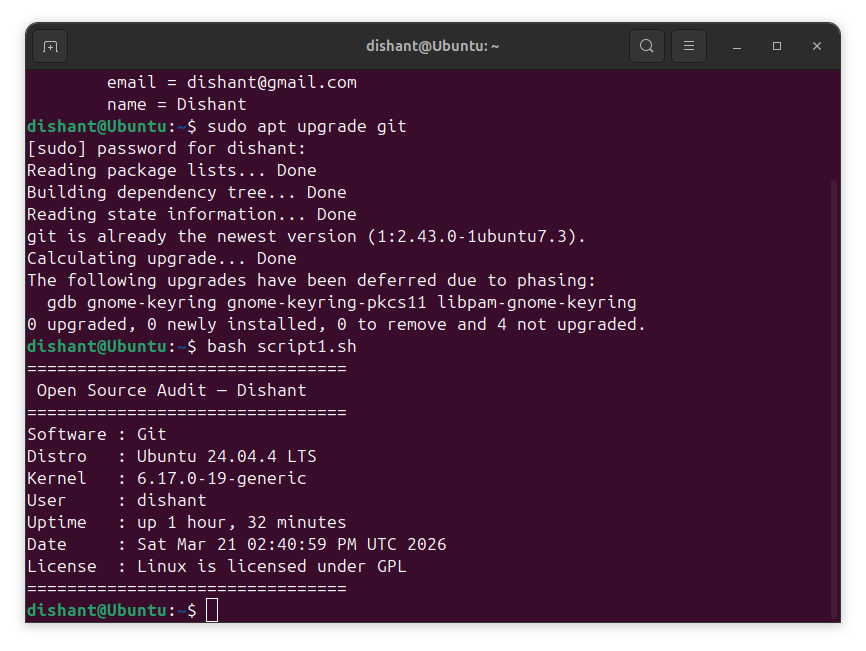
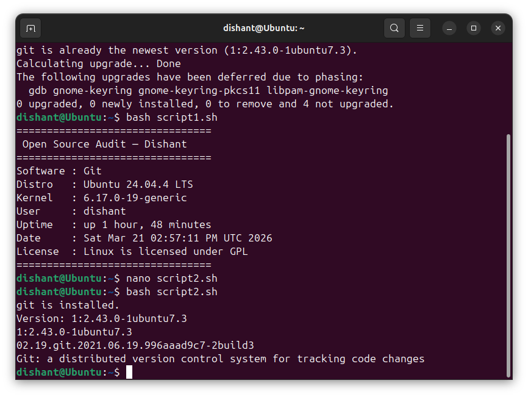
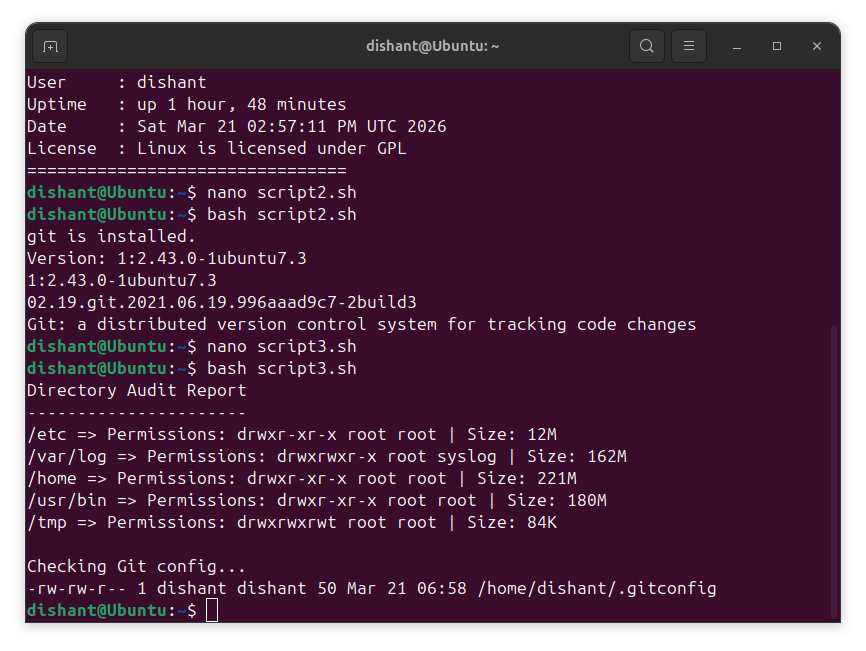
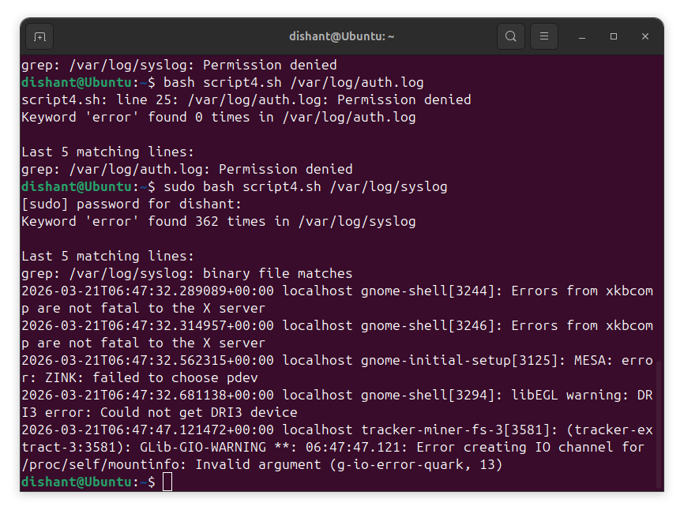
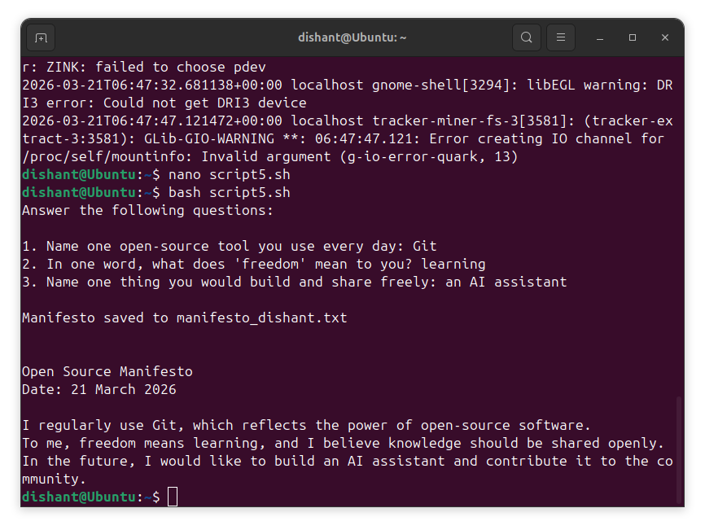

# Open Source Audit – Git


A comprehensive analysis of **Git**, a distributed version control system, as part of the Open Source Software course. This project combines theoretical understanding with practical implementation using Linux and shell scripting.

---

## Student Details
- **Name:** Dishant  
- **Course:** Open Source Software  
- **Project:** Open Source Audit  

---

## Project Overview

This project explores Git from multiple perspectives:

-  Origin and philosophy of open source  
-  Licensing and ethical considerations  
-  Integration with Linux systems  
-  Role in the open-source ecosystem  
-  Comparison with proprietary tools  

---

##  Project Structure
```
oss-audit-dishant/
├── script1.sh  #System Identity Report
├── script2.sh  # Package Inspector
├── script3.sh  # Disk & Permission Auditor
├── script4.sh  # Log Analyzer
├── script5.sh  # Manifest Generator
└── README.md
```

---

## Shell Scripts Overview

| Script | Description |
|-------|------------|
| **Script 1** | Displays system information (kernel, user, uptime, OS) |
| **Script 2** | Checks Git installation and shows version |
| **Script 3** | Analyzes directories, permissions, and disk usage |
| **Script 4** | Scans log files for errors |
| **Script 5** | Generates an open-source manifesto |

---

## Screenshots

> The following screenshots show the successful execution of each script.

### 🔹 Script 1 Output | Script 2 Output
<p align="center">
  
  
</p>

### 🔹 Script 3 Output | Script 4 Output
<p align="center">
  
  
</p>

### 🔹 Script 5 Output
<p align="center">
  
</p>

---

## How to Run

### 1. Give Permission
```bash
chmod +x script.sh
```
### 2. Run Script
```bash
./script.sh
```
OR
```bash
bash script.sh
```
---
## Requirements
- Linux (Ubuntu recommended)
- Bash shell
- Git installed

## Concepts Demonstrated
| **Concept**              | **Implementation**   |
|--------------------------|----------------------|
| Variables                | Used in all scripts  |
| Conditional Statements   | Script 2, Script 4   |
| Loops                    | Script 3, Script 4   |
| File Handling            | Script 5             |
| System Commands          | All scripts          |

### Sample Execution
```bash
$ bash script2.sh
git is installed.
Version: 2.xx.x
```

## Learning Outcomes
- Understanding open-source philosophy
- Hands-on experience with Linux
- Shell scripting fundamentals
- Git system integration

## Conclusion

This project provided both theoretical and practical insights into open-source software. Git demonstrates how powerful, flexible, and community-driven tools can shape modern software development.

---
